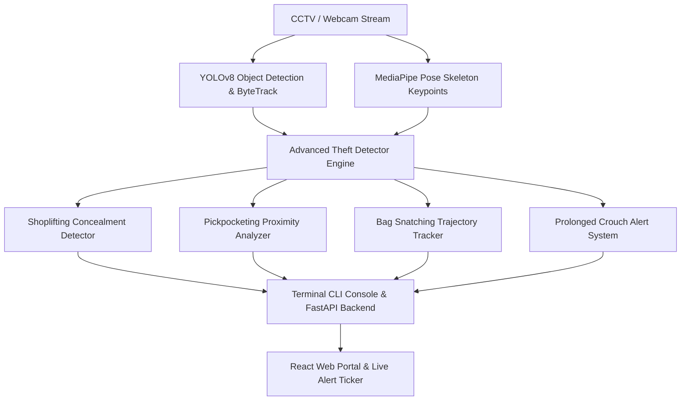

# 🛡️ AEGIS Guard — Multi-Strategy Theft Detection System

[](https://opensource.org/licenses/MIT)
[](https://www.python.org/)
[](https://fastapi.tiangolo.com/)
[](https://vitejs.dev/)
[](https://github.com/ultralytics/ultralytics)

**AEGIS Guard** is a real-time computer vision security system engineered to detect suspicious retail behaviors, shoplifting concealment, crowd pickpocketing, bag snatching, and unauthorized crouching using deep learning object tracking (`YOLOv8`) and skeletal pose estimation (`MediaPipe Pose`).

---

## 📸 System Overview & Architecture



### 🌟 Key Detection Strategies:
1. **🛍️ Shoplifting & Concealment**: Identifies fast hand movements into coat/jacket linings, pocketing merchandise, and prolonged shelf blindspot maneuvering.
2. **👛 Crowd Pickpocketing**: Tracks close spatial proximity between individuals and detects hand extensions into adjacent clothing pockets.
3. **🎒 Bag Snatching**: Monitors high-velocity hand-to-object movement vectors and sudden physical detachment.
4. **🧘 Prolonged Crouching**: Flags crouch postures exceeding customizable time thresholds in critical store ROI zones.

---

## 📁 Repository Structure

```
theft-detection/
├── src/
│   ├── config.py                 # Core detection thresholds & class configurations
│   ├── advanced_detector.py      # Primary YOLOv8 + MediaPipe Pose AI Detection Engine
│   └── detector.py               # Auxiliary detection utilities
├── backend/
│   └── app/
│       └── main.py               # FastAPI Enterprise REST API & WebSocket Feed Server
├── frontend/                     # React + Vite Enterprise Web Portal
│   ├── src/
│   │   ├── components/           # CameraFeed, Header, Sidebar, AlertDetailModal
│   │   ├── pages/                # Dashboard, VideoUploadStudio, AlertHistory, AdminPanel
│   │   └── services/api.js       # Central API Client & Data Layer
│   └── public/data/              # H.264 HTML5 Demo Videos
├── data/                         # Benchmark & Test CCTV Video Files
├── final_correct_demo.py         # Real Engine CLI Interactive Demonstration
├── standalone_upload_tester.py   # Batch Video Upload Analysis Tool
├── vercel.json                   # 1-Click Vercel Web Deployment Configuration
├── requirements.txt              # Python Dependencies
├── LICENSE                       # MIT License
└── README.md                     # Documentation
```

---

## ⚡ Quick Start Guide

### 1. Prerequisites
- **Python 3.10+** installed
- **Node.js 18+** & `npm` installed
- OpenSSL & OpenCV compatible display drivers

### 2. Installation

```bash
# Clone the repository
git clone https://github.com/Sandy5604G/multi-strategy-theft-detection.git
cd multi-strategy-theft-detection

# Set up Python Virtual Environment
python3 -m venv theft_detection_env
source theft_detection_env/bin/activate

# Install Python requirements
pip install -r requirements.txt

# Install Frontend dependencies
cd frontend
npm install
cd ..
```

---

## 🖥️ Usage & Execution

### 1. Interactive Terminal CLI Demo
Run the real AI engine directly in your terminal to process camera feeds or pre-loaded benchmark videos:

```bash
python3 final_correct_demo.py
```
**Options**:
- `1`: Pickpocketing Detection (`data/demo_pickpocketing.mp4`)
- `2`: Shoplifting Concealment (`data/demo_shoplifting.mp4`)
- `3`: Bag Theft Snatching (`data/demo_bag_snatching.mp4`)
- `4`: Live Webcam Real-Time Surveillance

---

### 2. Full Web Application & Backend API

#### Launch Backend Server (Port 8000):
```bash
./theft_detection_env/bin/python backend/app/main.py
```

#### Launch Frontend Web Portal (Port 5173):
```bash
cd frontend
npm run dev
```

Navigate to **`http://localhost:5173`** in your browser to access the **AEGIS Web Portal**.

---

## 🌐 Deploying to Vercel

This project includes a pre-configured [`vercel.json`](file:///home/sandeep/theft-detection/vercel.json) for 1-click frontend deployment:

1. Push your code to GitHub: `git push -u origin main`
2. Go to **[vercel.com/new](https://vercel.com/new)** and import **`Sandy5604G/multi-strategy-theft-detection`**.
3. Vercel will auto-detect **Vite** and deploy the web application.

---

## 📄 License

Distributed under the **MIT License**. See [`LICENSE`](file:///home/sandeep/theft-detection/LICENSE) for more information.
